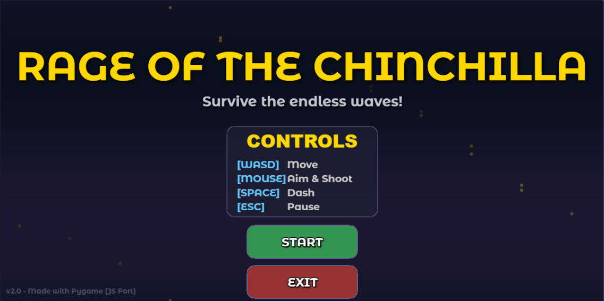
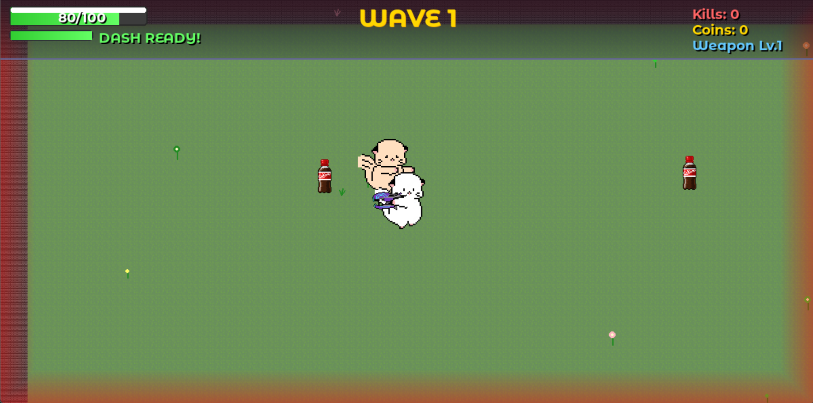

# Rage of the Chinchilla

A top-down survival shooter game built with Pygame. Control Smile the Chinchilla and survive endless waves of enemies!

## Screenshots

## Features

### v2.0 (Current)
- **Wave System**: Endless survival mode with progressive difficulty
- **Boss Enemies**: Larger enemies with unique attacks starting from Wave 3
- **Power-Up Stars**: Red (invincibility), Yellow (16-directional shooting), Purple (boss killer)
- **Shop System**: Upgrade weapons, buy health, unlock laser sight
- **Dash Ability**: Quick dodge with spacebar
- **Combo System**: Chain kills for bonus rewards
- **Enhanced UI**: Animated menus, gradient health bar, visual effects

### v1.0 (Original CS50 Project)
- Basic shooting gameplay
- Two enemy types: Antonio (melee) and Joker (ranged)
- Health restoration with cola pickups

## Controls

| Key | Action |
|-----|--------|
| WASD | Move |
| Mouse | Aim & Shoot |
| Space | Dash |
| ESC | Pause |
| 1-4 | Shop purchases |

## How to Play

1. Install Python 3.x (if not already installed)
2. Install dependencies: `pip install -r requirements.txt`
   - Or manually: `pip install pygame`
3. Run the game: `python game.py`
4. Survive as many waves as possible!

## Credits

- **Characters**: SMILE emoji from WeChat
- **Weapon**: Inspired by Halo's Sangheili plasma rifle
- **Tutorial Reference**: [Coding With Russ](https://www.youtube.com/c/CodingWithRuss)

## Version History

See [CHANGELOG.md](CHANGELOG.md) for detailed version history.

---
*Originally created as CS50 Final Project (December 2022)*
